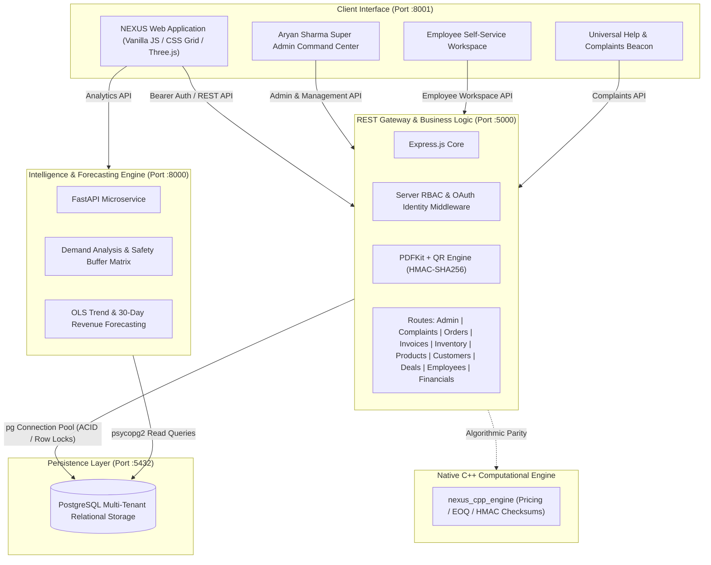
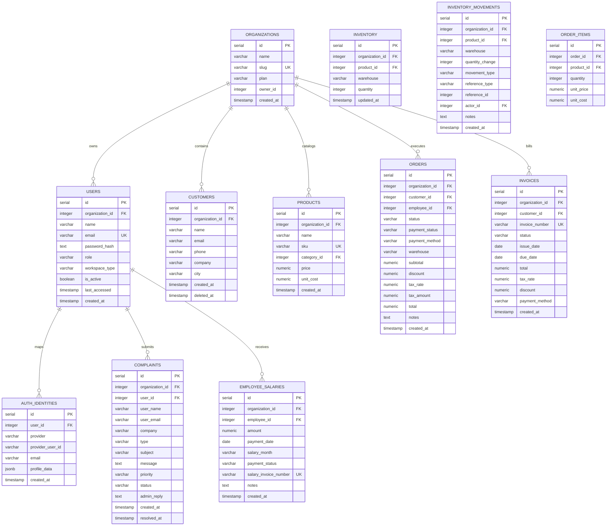

# NEXUS — Enterprise Operations & Intelligence Platform

<p align="center">
  
</p>

<p align="center">
  <a href="https://github.com/aaddi1"></a>
  <a href="https://www.linkedin.com/in/aryan-sharma11/"></a>
  <a href="https://www.instagram.com/aryansharma.dev/"></a>
  <a href="https://x.com/aaddi1"></a>
  <a href="https://nodejs.org/"></a>
  <a href="https://expressjs.com/"></a>
  <a href="https://www.postgresql.org/"></a>
  <a href="https://fastapi.tiangolo.com/"></a>
  <a href="https://www.python.org/"></a>
  <a href="https://threejs.org/"></a>
</p>

**NEXUS** is an enterprise-grade commercial operating system, ERP, CRM, and predictive intelligence platform designed for end-to-end multi-warehouse commercial operations. It unifies order orchestration, multi-location stock management, cryptographic invoice issuance, sales opportunity tracking, and predictive demand analytics within a zero-latency operational workspace.

Repository: [https://github.com/aaddi1/NEXUS](https://github.com/aaddi1/NEXUS)

---

## Architecture Overview

NEXUS utilizes a decoupled micro-architecture where transaction-heavy operations are isolated from analytical and forecasting workloads.



---

## Default Seeded Credentials

NEXUS includes seeded accounts configured with unique passwords per user:

| Role | Name | Email | Default Password | Workspace Type |
|---|---|---|---|---|
| **Super Admin & Owner** | Aryan Sharma | `aryan@nexus.com` | `aryan123` | System Command (`system`) |
| **Super Admin (Alias)** | Aryan Sharma | `admin123@nexus.com` | `admin123` | Enterprise Command (`enterprise`) |
| **Enterprise Owner** | Reliance Enterprise | `reliance@nexus.com` | `reliance123` | Enterprise ERP (`enterprise`) |
| **Retail Shop Owner** | Retail Store Manager | `shopowner@nexus.com` | `shopowner123` | Retail Shop POS (`shop_owner`) |
| **Sales Lead** | Riya Mehta | `riya@nexus.com` | `riya123` | Enterprise Employee (`enterprise`) |
| **Inventory Manager** | Rahul Kapoor | `rahul@nexus.com` | `rahul123` | Enterprise Employee (`enterprise`) |
| **Finance Lead** | Arjun Verma | `arjun@nexus.com` | `arjun123` | Enterprise Employee (`enterprise`) |
| **Sales Executive** | Priya Nair | `priya@nexus.com` | `priya123` | Enterprise Employee (`enterprise`) |

---

## Core Portals & Workspaces

### 1. 🛡️ Aryan Sharma Super Admin Control Center (`#screen-superadmin`)
- **System Command HUD**: Real-time monitoring of active PostgreSQL ACID pool connections, FastAPI engine status, CPU allocation, RAM utilization, and total platform transaction volumes.
- **Support & Complaints Dispatch Inbox**: Live inbox receiving all incoming tickets from clients, enterprise company owners, and retail shop owners with priority tags (`Critical`, `High`, `Normal`) and direct **Reply & Resolve** administrative logging.
- **Account Suspension & Direct Password Resets (`/api/admin/users/reset-password`)**: Platform-wide user registry with last-accessed timestamps, order histories, account deactivation/suspension toggles, and direct password resets.
- **System Diagnostics & Bug Tracker (`/api/admin/bugs`)**: Real-time error log capturing server exceptions, latency spikes, and runtime component diagnostic events.
- **Login Audit Trail (`/api/admin/logins`)**: Captured audit trail logging IP addresses, User-Agents, authentication providers (Google, GitHub, Microsoft, Password), and status.

---

### 2. 🏢 Enterprise Company & Retail Shop Owner Workspace
- **Executive Dashboard (`#screen-dashboard`)**: Live KPI cards (Revenue, Orders, Customers, Inventory Valuation), monthly revenue trend curves, top-selling SKU rankings, and chronological operational feeds.
- **Customer CRM (`#screen-customers`)**: Account registry tracking customer lifetime value (LTV), total orders placed, segment classifications (`VIP`, `Standard`, `New`), and automated professional portrait generation.
- **Catalog Management (`#screen-products`)**: SKU registry with automatic commercial packshot photo matching, category filters, Cost of Goods Sold (COGS), and live multi-warehouse stock sync.
- **Multi-Location Inventory (`#screen-inventory`)**: Warehouse management across **Mumbai WH-1**, **Delhi WH-2**, and **Bengaluru WH-3** with atomic stock adjustments and transfer workflows protected by PostgreSQL `FOR UPDATE` locks.
- **Permanent Inventory Movements Ledger (`inventory_movements`)**: Audit ledger recording every stock increment, sale, transfer, and restock.
- **Enterprise Order Creation Suite (`#screen-orders`)**:
  - **Inline Customer Registration**: Register and auto-select new customers directly inside the order creation flow.
  - **Multi-Item Line Ledger**: Select products with live pricing, step counter quantity adjusters, and line subtotal calculations.
  - **Dual-Mode Discount Selector**: Specify discounts either as a flat rupee reduction (`₹ Flat`) or as a percentage (`% Percent`).
  - **GST & Tax Computation**: Select GST rates (`0%`, `5%`, `12%`, `18% Standard`, `28% GST`) with live automated tax calculations.
  - **Payment & Dispatch**: Select payment method (UPI, Net Banking, Card, NEFT, Cash) and dispatch warehouse depot.
  - **Instant Invoice Generation**: Auto-generate sequential tax invoices with cryptographic HMAC-SHA256 QR signatures upon order completion.
- **Invoice Billing & Cryptographic QR Verification (`#screen-invoices`)**:
  - Issue vector PDF invoices with high-ECC dynamic QR codes.
  - Public tamper-evident verification endpoint guarded by `crypto.timingSafeEqual`.
  - In-browser printable PDF viewer.
- **Sales Pipeline / Deals CRM (`#screen-sales`)**: Track deal stages (`Discovery 25%`, `Proposal 50%`, `Negotiation 75%`, `Closed won 100%`), contract values, and weighted revenue pipelines.
- **AI Business Intelligence & Demand Intelligence (`#screen-analytics`)**:
  - Revenue by Category bar charts and Sales Channel donut graphs (Online, Direct, Wholesale).
  - 14-day revenue velocity charts and 30-day OLS machine learning cash flow projections.
  - Product demand run-out matrix categorizing stock risk (`Critical`, `High`, `Medium`, `Low`).

---

### 3. 💼 Employee Self-Service Workspace (`#screen-emp-dashboard`)
- **My Sales (`#screen-emp-sales`)**: Personal sales attributed to the employee with customer info, fulfillment state, and date.
- **My Items (`#screen-emp-items`)**: Traceable record of sample products and inventory items issued to or held by the employee with return status.
- **My Salary (`#screen-emp-salary`)**: Compensation breakdown, disbursement dates, and sequential salary invoices (`SAL-2026-08-01`).
- **My Issues (`#screen-emp-issues`)**: Track support tickets submitted to the Founder/Admin with real-time resolution notes.

---

### 4. 📲 PWA Desktop & Mobile Application Architecture
- **Web App Manifest (`frontend/manifest.json`)**: Configured for standalone window execution with app shortcuts and theme branding.
- **Service Worker (`frontend/sw.js`)**: Offline shell caching with background sync.
- **Desktop Install Button (`frontend/js/pwa.js`)**: Dynamic "Install App" button in the topbar for one-click installation on macOS, Windows, and mobile devices.

---

## Database Schema & Multi-Tenant Model



---

## Native C++ Computational Engine (`cpp/`)

NEXUS includes a high-performance native C++ engine compiled with CMake and Clang++ 17:

- **`cpp/include/pricing_engine.hpp`**: High-speed GST tax computation (CGST, SGST, IGST), dual-mode discounts (`₹ Flat` vs `% Percent`), and currency conversion table (INR, USD, EUR, GBP, AED, JPY).
- **`cpp/include/inventory_optimizer.hpp`**: Multi-warehouse reorder point evaluation, Economic Order Quantity (EOQ) formula, safety stock calculations, and warehouse transfer validation.
- **`cpp/include/crypto_engine.hpp`**: Constant-time HMAC-SHA256 vector invoice checksum verification.
- **`cpp/src/main.cpp`**: Standalone benchmarking executable (`nexus_cpp_engine`).

### Building the C++ Engine:
```bash
mkdir -p cpp/build && cd cpp/build
cmake .. && make
./nexus_cpp_engine
```

---

## Automated Test Suite (15/15 Integration Tests)

Run the integration test suite:
```bash
npm test
```

### Quality Gate Matrix:
- `✓ PASS: Backend Health Check (/api/health)`
- `✓ PASS: Super Admin Authentication (aryan@nexus.com)`
- `✓ PASS: Employee Authentication (riya@nexus.com)`
- `✓ PASS: Registration Role Escalation Prevention (role=superadmin blocked)`
- `✓ PASS: RBAC: Employee cannot access /api/admin/stats (HTTP 403)`
- `✓ PASS: RBAC: Super Admin can access /api/admin/stats (HTTP 200)`
- `✓ PASS: Password Reset Request (/api/auth/forgot-password)`
- `✓ PASS: Commerce: Create Order with Atomic Stock Decrement`
- `✓ PASS: Commerce: Reject Order when Stock is Insufficient (HTTP 400)`
- `✓ PASS: Employee Workspace: Scoped Personal Stats & Sales (/api/employees/me/workspace)`
- `✓ PASS: Financial Intelligence Overview (/api/financials/overview)`
- `✓ PASS: Complaints System: Submit Ticket -> Super Admin Resolve`
- `✓ PASS: SSO: OAuth Identity Linking & Audit Log (/api/auth/sso)`
- `✓ PASS: Inventory: Atomic Stock Transfer with ACID Locking (/api/inventory/transfer)`
- `✓ PASS: Invoice: Vector PDF Stream & Cryptographic Verification`

---

## Quickstart & Local Setup

### 1. Database Initialization
```bash
createdb nexus
psql -d nexus -f database/schema.sql
psql -d nexus -f database/seed.sql
```

### 2. Backend Gateway Startup (Port 5000)
```bash
cd backend
npm install
node src/server.js
```

### 3. Analytics Engine Startup (Port 8000)
```bash
cd analytics
source .venv/bin/activate
pip install fastapi uvicorn psycopg2-binary python-dotenv numpy
uvicorn main:app --host 0.0.0.0 --port 8000 --reload
```

### 4. Client Application (Port 8001)
```bash
cd frontend
python3 -m http.server 8001
```
Access in browser: `http://localhost:8001`.

---

## Author & Connect

**Aryan Sharma**

- **GitHub**: [@aaddi1](https://github.com/aaddi1)
- **LinkedIn**: [Aryan Sharma](https://www.linkedin.com/in/aryan-sharma11/)
- **Instagram**: [@aryansharma.dev](https://www.instagram.com/aryansharma.dev/)
- **X (Twitter)**: [@aaddi1](https://x.com/aaddi1)
- **Email**: [aryan@nexus.com](mailto:aryan@nexus.com)

---

## License

Proprietary Software. Copyright © 2026 NEXUS. All Rights Reserved. Unauthorized duplication, modification, or commercial distribution is strictly prohibited.
