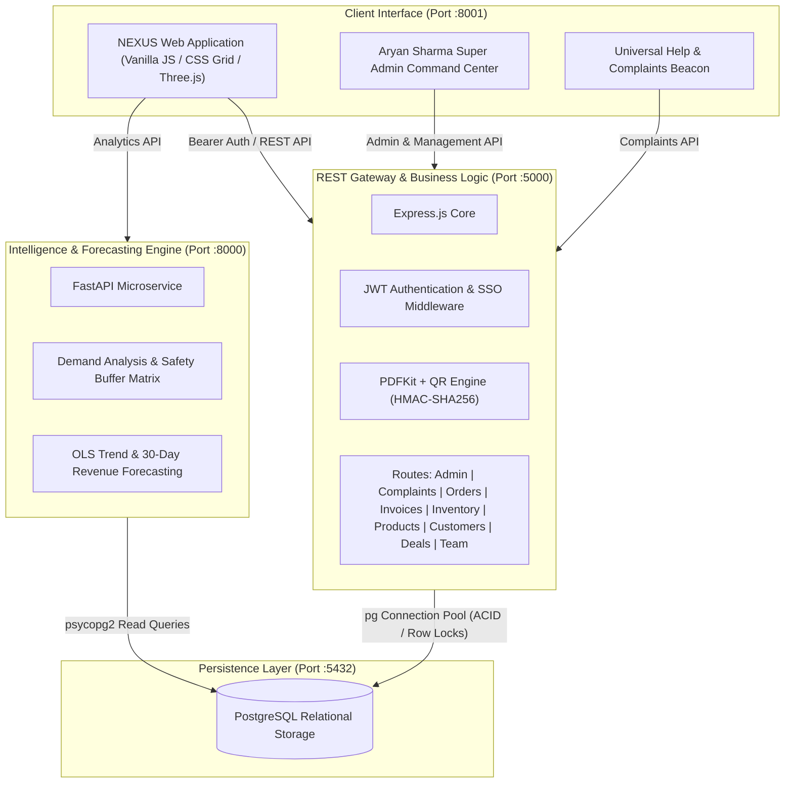
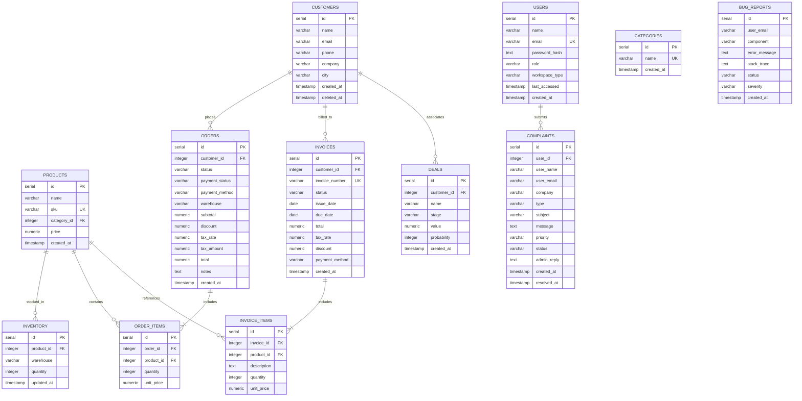

# NEXUS — Enterprise Operations & Intelligence Platform

<p align="center">
  
</p>

<p align="center">
  <a href="https://github.com/aaddi1"></a>
  <a href="https://www.linkedin.com/in/aryan-sharma11/"></a>
  <a href="https://www.instagram.com/aryansharma.dev/"></a>
  <a href="https://x.com/aaddi1"></a>
  <a href="https://nodejs.org/"></a>
  <a href="https://expressjs.com/"></a>
  <a href="https://www.postgresql.org/"></a>
  <a href="https://fastapi.tiangolo.com/"></a>
  <a href="https://www.python.org/"></a>
  <a href="https://threejs.org/"></a>
</p>

**NEXUS** is an enterprise-grade commercial operating system, ERP, CRM, and predictive intelligence platform designed for end-to-end multi-warehouse commercial operations. It unifies order orchestration, multi-location stock management, cryptographic invoice issuance, sales opportunity tracking, and predictive demand analytics within a zero-latency operational workspace.

Repository: [https://github.com/aaddi1/NEXUS](https://github.com/aaddi1/NEXUS)

---

## Architecture Overview

NEXUS utilizes a decoupled micro-architecture where transaction-heavy operations are isolated from analytical and forecasting workloads.



---

## Default Seeded Credentials

NEXUS includes seeded accounts configured across different workspace roles:

| Role | Name | Email | Default Password | Workspace Type |
|---|---|---|---|---|
| **Super Admin & Owner** | Aryan Sharma | `aryan@nexus.com` | `admin123` | System Command (`system`) |
| **Super Admin (Alias)** | Aryan Sharma | `admin123@nexus.com` | `admin123` | Enterprise Command (`enterprise`) |
| **Enterprise Owner** | Reliance Enterprise | `reliance@nexus.com` | `admin123` | Enterprise ERP (`enterprise`) |
| **Retail Shop Owner** | Retail Store Manager | `shopowner@nexus.com` | `admin123` | Retail Shop POS (`shop_owner`) |
| **Sales Lead** | Riya Mehta | `riya@nexus.com` | `admin123` | Enterprise (`enterprise`) |
| **Inventory Manager** | Rahul Kapoor | `rahul@nexus.com` | `admin123` | Enterprise (`enterprise`) |
| **Finance Lead** | Arjun Verma | `arjun@nexus.com` | `admin123` | Enterprise (`enterprise`) |

---

## Core Portals & Workspaces

### 1. 🛡️ Aryan Sharma Super Admin Control Center (`#screen-superadmin`)
- **System Command HUD**: Real-time monitoring of active PostgreSQL ACID pool connections, FastAPI engine status, CPU allocation, RAM utilization, and total platform transaction volumes.
- **Support & Complaints Dispatch Inbox**: Live inbox receiving all incoming tickets from clients, enterprise company owners, and retail shop owners with priority tags (`Critical`, `High`, `Normal`) and direct **Reply & Resolve** administrative logging.
- **Account Control & Direct Password Resets (`/api/admin/users/reset-password`)**: Platform-wide user registry displaying last-accessed timestamps, order histories, and a direct action to reset/assign credentials for any account.
- **System Diagnostics & Bug Tracker (`/api/admin/bugs`)**: Real-time error log capturing server exceptions, latency spikes, and runtime component diagnostic events.
- **Account Provisioning**: Instant modal to provision new Enterprise Company or Retail Shop Owner accounts in PostgreSQL.

---

### 2. 🏢 Enterprise Company & Retail Shop Owner Workspace
- **Executive Dashboard (`#screen-dashboard`)**: Live KPI cards (Revenue, Orders, Customers, Inventory Valuation), monthly revenue trend curves, top-selling SKU rankings, and chronological operational feeds.
- **Customer CRM (`#screen-customers`)**: Account registry tracking customer lifetime value (LTV), total orders placed, segment classifications (`VIP`, `Standard`, `New`), and automated professional portrait generation.
- **Catalog Management (`#screen-products`)**: SKU registry with automatic commercial packshot photo matching, category filters, and live multi-warehouse stock sync.
- **Multi-Location Inventory (`#screen-inventory`)**: Warehouse management across **Mumbai WH-1**, **Delhi WH-2**, and **Bengaluru WH-3** with atomic stock adjustments and transfer workflows protected by PostgreSQL `FOR UPDATE` locks.
- **Enterprise Order Creation Suite (`#screen-orders`)**:
  - **Inline Customer Registration**: Register and auto-select new customers directly inside the order creation flow.
  - **Multi-Item Line Ledger**: Select products with live pricing, step counter quantity adjusters, and line subtotal calculations.
  - **Dual-Mode Discount Selector**: Specify discounts either as a flat rupee reduction (`₹ Flat`) or as a percentage (`% Percent`).
  - **GST & Tax Computation**: Select GST rates (`0%`, `5%`, `12%`, `18% Standard`, `28% GST`) with live automated tax calculations.
  - **Payment & Dispatch**: Select payment method (UPI, Net Banking, Card, NEFT, Cash) and dispatch warehouse depot.
  - **Instant Invoice Generation**: Auto-generate sequential tax invoices with cryptographic HMAC-SHA256 QR signatures upon order completion.
- **Invoice Billing & Cryptographic QR Verification (`#screen-invoices`)**:
  - Issue vector PDF invoices with high-ECC dynamic QR codes.
  - Public tamper-evident verification endpoint guarded by `crypto.timingSafeEqual`.
  - In-browser printable PDF viewer.
- **Sales Pipeline / Deals CRM (`#screen-sales`)**: Track deal stages (`Discovery 25%`, `Proposal 50%`, `Negotiation 75%`, `Closed won 100%`), contract values, and weighted revenue pipelines.
- **AI Business Intelligence & Demand Intelligence (`#screen-analytics`)**:
  - Revenue by Category bar charts and Sales Channel donut graphs (Online, Direct, Wholesale).
  - 14-day revenue velocity charts and 30-day OLS machine learning cash flow projections.
  - Product demand run-out matrix categorizing stock risk (`Critical`, `High`, `Medium`, `Low`).

---

### 3. 🆘 Universal "Help & Raise a Complaint" System
- **Floating Help Beacon (`#nx-floating-help-btn`)**: Fixed universal support beacon available across all screens for both clients and store owners.
- **Structured Dispatch Modal (`/api/complaints`)**:
  - Form fields: Full Name, Email, Company Name, Category, Severity (`Critical`, `High`, `Medium`, `Low`), Subject, and Message.
  - Direct PostgreSQL logging with immediate dispatch to Aryan Sharma's Super Admin Inbox.

---

### 4. 🧮 Utility & Compliance Subsystems
- **Dual-Pane Calculator & Currency Converter**: Arithmetic keypad with transaction history alongside a live real-time currency converter across **INR (₹)**, **USD ($)**, **EUR (€)**, **GBP (£)**, **AED**, and **JPY**.
- **Legal & Compliance Suite (`frontend/js/legal.js`)**: Modals for **Terms of Service**, **Privacy Policy**, **Community Guidelines**, and **Proprietary License**.
- **Zero-Flicker Session Persistence**: CSS-level pre-paint session validation (`.nexus-authenticated`) ensuring page refreshes never log out.
- **Social Single Sign-On (SSO)**: One-click sign-in via Google, GitHub, and Microsoft OAuth integrations.

---

## Database Schema & Relations



---

## API Reference Matrix

### Authentication & Single Sign-On
| Method | Endpoint | Description | Auth Required |
|---|---|---|---|
| `POST` | `/api/auth/login` | Authenticate user credentials and issue JWT | No |
| `POST` | `/api/auth/register` | Register new enterprise/shop workspace user | No |
| `POST` | `/api/auth/sso` | Social SSO (Google, GitHub, Microsoft) | No |
| `GET` | `/api/auth/me` | Fetch authenticated user profile details | Bearer JWT |

### Super Admin Command Center (`Aryan Sharma`)
| Method | Endpoint | Description | Auth Required |
|---|---|---|---|
| `GET` | `/api/admin/stats` | Platform-wide KPIs & system health diagnostics | Bearer JWT |
| `GET` | `/api/admin/users` | List all platform accounts & last-accessed times | Bearer JWT |
| `POST` | `/api/admin/users/reset-password` | Directly reset/set password for any account | Bearer JWT |
| `GET` | `/api/admin/bugs` | List all system errors and runtime bug logs | Bearer JWT |
| `PATCH` | `/api/admin/bugs/:id/status` | Mark system bug as resolved | Bearer JWT |

### Help Desk & Complaints
| Method | Endpoint | Description | Auth Required |
|---|---|---|---|
| `POST` | `/api/complaints` | Submit support ticket / complaint | Bearer JWT |
| `GET` | `/api/complaints` | List all tickets for Super Admin inbox | Bearer JWT |
| `PATCH` | `/api/complaints/:id/resolve` | Send admin resolution & resolve ticket | Bearer JWT |
| `DELETE` | `/api/complaints/:id` | Purge ticket record | Bearer JWT |

### Orders & Invoicing
| Method | Endpoint | Description | Auth Required |
|---|---|---|---|
| `GET` | `/api/orders` | List order book with payment & fulfillment states | Bearer JWT |
| `POST` | `/api/orders` | Create order with dual discounts, GST, & auto-invoice | Bearer JWT |
| `PATCH` | `/api/orders/:id/status` | Mutate fulfillment & payment status | Bearer JWT |
| `GET` | `/api/invoices` | List invoices with tax & discount breakdowns | Bearer JWT |
| `POST` | `/api/invoices` | Generate invoice & line items in PostgreSQL | Bearer JWT |
| `PATCH` | `/api/invoices/:id/status` | Update invoice status (`due`, `paid`, `draft`) | Bearer JWT |
| `GET` | `/api/invoices/:id/pdf` | Vector PDF stream with embedded QR code | Bearer JWT |
| `GET` | `/api/invoices/public/:num/:sig.pdf` | Public cryptographic invoice PDF endpoint | No (HMAC guarded) |

### Products, Categories & Inventory
| Method | Endpoint | Description | Auth Required |
|---|---|---|---|
| `GET` | `/api/products` | Retrieve catalog with category associations | Bearer JWT |
| `POST` | `/api/products` | Insert new SKU into catalog | Bearer JWT |
| `PUT` | `/api/products/:id` | Update product SKU and pricing | Bearer JWT |
| `DELETE` | `/api/products/:id` | Delete product SKU | Bearer JWT |
| `GET` | `/api/categories` | List categories with product count joins | Bearer JWT |
| `GET` | `/api/inventory` | List multi-warehouse inventory allocations | Bearer JWT |
| `PATCH` | `/api/inventory/:id` | Adjust absolute stock count | Bearer JWT |
| `POST` | `/api/inventory/transfer` | Atomic multi-warehouse stock transfer | Bearer JWT |

### Customers, Deals, Team & Analytics
| Method | Endpoint | Description | Auth Required |
|---|---|---|---|
| `GET` | `/api/customers` | List customers with aggregated LTV | Bearer JWT |
| `POST` | `/api/customers` | Register customer record | Bearer JWT |
| `GET` | `/api/deals` | Fetch active sales pipeline opportunities | Bearer JWT |
| `POST` | `/api/deals` | Create opportunity with stage & probability | Bearer JWT |
| `GET` | `/api/team` | List workspace team members | Bearer JWT |
| `POST` | `/api/team` | Invite / add workspace team member | Bearer JWT |
| `GET` | `/api/notifications` | Dynamic business notification feed | Bearer JWT |
| `GET` | `/api/dashboard/stats` | Aggregated dashboard stats & activity feed | Bearer JWT |

### FastAPI Analytics Engine (`Port :8000`)
| Method | Endpoint | Description |
|---|---|---|
| `GET` | `/health` | Verify analytics engine & database connectivity |
| `GET` | `/analytics/overview` | Core revenue, orders, AOV, and aggregate unit metrics |
| `GET` | `/analytics/forecast` | Linear regression OLS revenue trend & 30-day projection |
| `GET` | `/analytics/product-demand` | Stock run-out projection and risk categorization |
| `GET` | `/analytics/reorder` | Replenishment recommendations with 20% safety margin |

---

## Directory Structure

```text
NEXUS/
├── analytics/                  # Python Intelligence & Machine Learning Engine
│   ├── .venv/                  # Python virtual environment
│   ├── main.py                 # FastAPI application & OLS mathematical models
│   └── .env                    # Analytics database configuration
├── backend/                    # Node.js REST API Gateway
│   ├── assets/fonts/           # Typography assets for vector PDF generation
│   ├── src/
│   │   ├── db/                 # PostgreSQL pool initialization
│   │   ├── routes/             # Express route controllers
│   │   │   ├── admin.js        # Super Admin command, password resets & bug tracker
│   │   │   ├── auth.js         # JWT auth, registration & SSO handlers
│   │   │   ├── categories.js   # Product category controllers
│   │   │   ├── complaints.js   # Help desk & complaint dispatch system
│   │   │   ├── customers.js    # CRM operations & LTV tracking
│   │   │   ├── dashboard.js    # High-speed unified dashboard metrics
│   │   │   ├── deals.js        # Sales pipeline management
│   │   │   ├── inventory.js    # Multi-location inventory & atomic transfer
│   │   │   ├── invoices.js     # PDFKit generation & HMAC-SHA256 verification
│   │   │   ├── notifications.js# Dynamic business event aggregator
│   │   │   ├── orders.js       # Transactional order orchestration
│   │   │   ├── products.js     # SKU catalog management
│   │   │   └── team.js         # Team & user management
│   │   ├── middleware.js       # Bearer token validation
│   │   └── server.js           # Server bootstrap & CORS configuration
│   ├── package.json            # Node.js dependencies
│   └── .env                    # Node.js runtime configuration
├── cpp/                        # Native C++ Optimization Engine
│   ├── include/                # Header declarations
│   ├── src/                    # High-speed OLS and stock risk algorithms
│   └── CMakeLists.txt          # CMake build configuration
├── database/                   # PostgreSQL DDL and DML scripts
│   ├── schema.sql              # Table definitions, constraints, and sequences
│   └── seed.sql                # Initial seed data and test accounts
├── docs/                       # Architectural diagrams and brand assets
│   └── assets/toad-seal.svg    # Official vector brand seal
├── frontend/                   # Client-side web application
│   ├── css/
│   │   └── style.css           # Design system, themes & animations
│   ├── favicon.svg             # Vector brand mark
│   ├── index.html              # Clean semantic HTML markup
│   └── js/                     # Modular client-side controllers
│       ├── api.js              # Centralized REST API client
│       ├── app.js              # Core UI orchestration & modal handlers
│       ├── auth.js             # Session persistence & SSO controller
│       ├── converter-guard.js  # Keyboard navigation protection
│       ├── deals-backend.js    # Pipeline sync listeners
│       ├── demand-intelligence.js # Run-out risk categorization
│       ├── failsafe.js         # Action delegation & navigation router
│       ├── forecast.js         # AI revenue trend visualizer
│       ├── help-complaints.js  # Universal floating help beacon
│       ├── invoices-backend.js # Invoice ledger sync
│       ├── legal.js            # Terms, Privacy & Compliance viewer
│       ├── live-analytics.js   # Category & channel chart engine
│       ├── live-dashboard.js   # Real-time KPI feed
│       ├── live-data.js        # Global workspace hydration engine
│       ├── live-deals.js       # Deals view sync
│       ├── live-inventory.js   # Warehouse stock sync
│       ├── live-invoices.js    # Invoices view sync
│       ├── live-orders.js      # Orders view sync
│       ├── live-products.js    # Catalog view sync
│       ├── orders-backend.js   # Order ledger listeners
│       ├── password-toggle.js  # Secure password visibility toggler
│       ├── super-admin.js      # Aryan Sharma Admin Command Center
│       └── three-bg.js         # Three.js WebGL ambient background
├── package.json                # Root orchestration package configuration
└── README.md                   # Complete system documentation
```

---

## Quickstart & Local Setup

### 1. Database Initialization

```bash
# Create PostgreSQL database
createdb nexus

# Execute schema definition
psql -d nexus -f database/schema.sql

# Populate initial seed data
psql -d nexus -f database/seed.sql
```

---

### 2. Backend Gateway Startup

```bash
cd backend
npm install
node src/server.js
```
The REST API will be available at `http://localhost:5000`.

---

### 3. Analytics Engine Startup

```bash
cd analytics
source .venv/bin/activate
pip install fastapi uvicorn psycopg2-binary python-dotenv numpy
uvicorn main:app --host 0.0.0.0 --port 8000 --reload
```
The Intelligence API will be available at `http://localhost:8000`.

---

### 4. Client Web Application

```bash
cd frontend
python3 -m http.server 8001
```
Access the application in your browser at `http://localhost:8001`.

---

## Security Model

1. **Parameter Sanitization**: All database interactions use parameterized bind variables (`$1`, `$2`, etc.) to prevent SQL injection vulnerabilities.
2. **Cryptographic Signatures**: Public invoice documents require an HMAC-SHA256 digest matching the document identifier.
3. **Constant-Time Verification**: Signature evaluations utilize `crypto.timingSafeEqual` with buffer length validation to protect against side-channel timing attacks.
4. **Isolated Token Storage**: Client tokens are managed with standard Bearer authorization schemes.

---

## Author & Connect

**Aryan Sharma**

- **GitHub**: [@aaddi1](https://github.com/aaddi1)
- **LinkedIn**: [Aryan Sharma](https://www.linkedin.com/in/aryan-sharma11/)
- **Instagram**: [@aryansharma.dev](https://www.instagram.com/aryansharma.dev/)
- **X (Twitter)**: [@aaddi1](https://x.com/aaddi1)
- **Email**: [aryan@nexus.com](mailto:aryan@nexus.com)

---

## License

Proprietary Software. Copyright © 2026 NEXUS. All Rights Reserved. Unauthorized duplication, modification, or commercial distribution is strictly prohibited.
