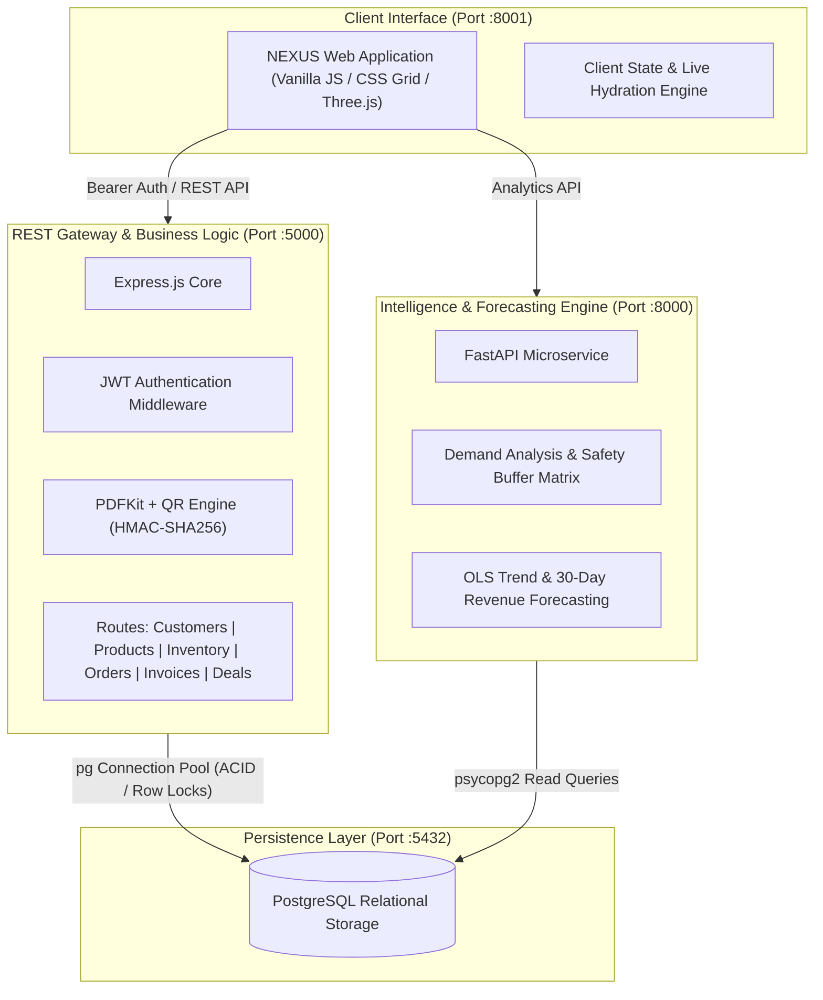
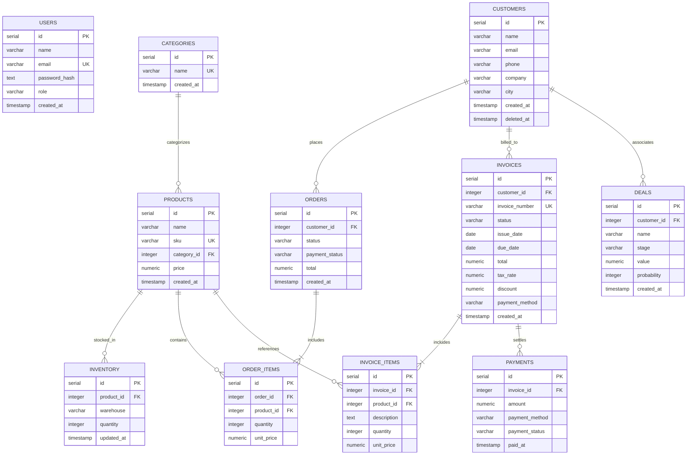

# NEXUS — Enterprise Operations & Intelligence Platform

<p align="center">
  
</p>

<p align="center">
  <a href="https://github.com/aaddi1"></a>
  <a href="https://www.linkedin.com/in/aryan-sharma11/"></a>
  <a href="https://www.instagram.com/aryansharma.dev/"></a>
  <a href="https://x.com/aaddi1"></a>
  <a href="https://nodejs.org/"></a>
  <a href="https://expressjs.com/"></a>
  <a href="https://www.postgresql.org/"></a>
  <a href="https://fastapi.tiangolo.com/"></a>
  <a href="https://www.python.org/"></a>
  <a href="https://threejs.org/"></a>
</p>

**NEXUS** is a high-performance, modular enterprise resource planning (ERP), CRM, and business intelligence platform designed for end-to-end commercial operations. It unifies order orchestration, multi-warehouse stock management, cryptographic invoice issuance, sales pipeline tracking, and predictive demand analytics within a unified operational workspace.

Repository: [https://github.com/aaddi1/NEXUS](https://github.com/aaddi1/NEXUS)

---

## Architecture Overview

NEXUS utilizes a decoupled micro-architecture where transaction-heavy operations are isolated from analytical and forecasting workloads.



---

## Core Subsystems

### 1. High-Concurrency REST API Gateway (`Node.js / Express`)
- **Connection Pooling**: Backed by `pg.Pool` with parameterized query sanitization.
- **Concurrency & Locking**: Multi-warehouse stock transfers execute inside atomic PostgreSQL transactions utilizing `SELECT ... FOR UPDATE` row-level mutexes.
- **Authentication**: Stateless JSON Web Token (`jsonwebtoken`) bearer authentication with `bcrypt` (10 rounds) password hashing.

### 2. Cryptographic Invoicing & Verification Engine
- **Vector PDF Generation**: High-precision vector rendering using `PDFKit` and SVG conversion via `svg-to-pdfkit`.
- **Public Authenticity Signatures**: Invoices generate a deterministic HMAC-SHA256 signature calculated against the document sequence and runtime secret.
- **Embedded Dynamic QR Verification**: Each invoice contains an embedded High-ECC QR code leading to a tamper-evident public endpoint (`/api/invoices/public/:invoiceNumber/:signature.pdf`) with constant-time (`crypto.timingSafeEqual`) authentication.

### 3. Business Intelligence & Predictive Analytics (`Python / FastAPI`)
- **Linear Trend Extrapolation**: Computes ordinary least-squares (OLS) slope analysis over historical order volumes to model 30-day forward cash flow and revenue trajectory.
- **Stock Depletion & Run-Out Matrix**: Aggregates decoupled sales velocity and inventory tables into days-remaining metrics and categorizes stock risk (`critical`, `high`, `medium`, `low`).
- **Dynamic Reorder Recommender**: Computes stock replenish recommendations incorporating lead-time burn rate and a 20% safety buffer.

### 4. Interactive Zero-Dependency Client Layer
- **High-Performance DOM Engine**: Built without heavy framework overhead to maximize responsiveness and paint cycles.
- **3D Visualization**: Native WebGL viewport integration powered by `Three.js` (r128).
- **Client-Side Export Pipeline**: Integrated `SheetJS` (XLSX) streaming export and native printable document synthesizer.

---

## Database Schema & Relations

The PostgreSQL schema enforces strict relational integrity with cascade rules, custom sequences, and index constraints.



---

## API Reference

### Authentication
| Method | Endpoint | Description | Auth Required |
|---|---|---|---|
| `POST` | `/api/auth/login` | Authenticate user credentials and issue JWT | No |

### Customers & CRM
| Method | Endpoint | Description | Auth Required |
|---|---|---|---|
| `GET` | `/api/customers` | List all active customers with aggregated LTV | Bearer JWT |
| `GET` | `/api/customers/:id` | Fetch customer profile by ID | Bearer JWT |
| `POST` | `/api/customers` | Register a new customer record | Bearer JWT |
| `PUT` | `/api/customers/:id` | Update customer metadata | Bearer JWT |
| `DELETE` | `/api/customers/:id` | Soft-delete / archive customer | Bearer JWT |

### Products & Multi-Warehouse Inventory
| Method | Endpoint | Description | Auth Required |
|---|---|---|---|
| `GET` | `/api/products` | Retrieve catalog with category associations | Bearer JWT |
| `POST` | `/api/products` | Insert new SKU into catalog | Bearer JWT |
| `PUT` | `/api/products/:id` | Update product SKU and pricing | Bearer JWT |
| `DELETE` | `/api/products/:id` | Delete product (with constraint protection) | Bearer JWT |
| `GET` | `/api/inventory` | List warehouse stock allocations | Bearer JWT |
| `PATCH` | `/api/inventory/:id` | Adjust absolute stock count | Bearer JWT |
| `POST` | `/api/inventory/transfer` | Atomic multi-warehouse stock transfer | Bearer JWT |

### Orders & Invoicing
| Method | Endpoint | Description | Auth Required |
|---|---|---|---|
| `GET` | `/api/orders` | List order ledger with payment & fulfillment state | Bearer JWT |
| `POST` | `/api/orders` | Create transaction order and line items | Bearer JWT |
| `PATCH` | `/api/orders/:id/status` | Mutate order and payment status | Bearer JWT |
| `GET` | `/api/invoices` | List invoices with discount & tax calculations | Bearer JWT |
| `POST` | `/api/invoices` | Generate invoice and line-item records | Bearer JWT |
| `PATCH` | `/api/invoices/:id/status` | Update invoice status (`draft`, `due`, `paid`, etc.) | Bearer JWT |
| `GET` | `/api/invoices/:id/pdf` | Generate vector invoice PDF on-the-fly | Bearer JWT |
| `GET` | `/api/invoices/public/:num/:sig.pdf` | Public cryptographic invoice PDF endpoint | No (HMAC guarded) |

### Sales Pipeline (Deals)
| Method | Endpoint | Description | Auth Required |
|---|---|---|---|
| `GET` | `/api/deals` | Fetch active pipeline opportunities | Bearer JWT |
| `POST` | `/api/deals` | Create opportunity with stage & probability | Bearer JWT |
| `PUT` | `/api/deals/:id` | Update deal terms | Bearer JWT |
| `PATCH` | `/api/deals/:id/stage` | Transition sales stage | Bearer JWT |
| `DELETE` | `/api/deals/:id` | Purge deal from pipeline | Bearer JWT |

### Analytics & Intelligence Microservice (`Port :8000`)
| Method | Endpoint | Description |
|---|---|---|
| `GET` | `/health` | Verify analytics engine & database connectivity |
| `GET` | `/analytics/overview` | Core revenue, orders, AOV, and aggregate unit metrics |
| `GET` | `/analytics/forecast` | Linear regression OLS revenue trend & 30-day projection |
| `GET` | `/analytics/product-demand` | Stock run-out projection and risk categorization |
| `GET` | `/analytics/reorder` | Replenishment recommendations with 20% safety margin |

---

## Directory Structure

```text
NEXUS/
├── analytics/                  # Python Intelligence Engine
│   ├── .venv/                  # Dedicated Python virtual environment
│   ├── main.py                 # FastAPI application & mathematical models
│   └── .env                    # Analytics database configuration
├── backend/                    # Node.js REST API Gateway
│   ├── assets/fonts/           # Typography assets for vector PDF generation
│   ├── src/
│   │   ├── db/                 # PostgreSQL pool initialization
│   │   ├── routes/             # Express route controllers
│   │   │   ├── auth.js         # JWT auth & bcrypt verification
│   │   │   ├── customers.js    # CRM operations & LTV tracking
│   │   │   ├── deals.js        # Sales pipeline management
│   │   │   ├── inventory.js    # Multi-location inventory & atomic transfer
│   │   │   ├── invoices.js     # PDF generation & HMAC verification
│   │   │   ├── orders.js       # Transactional order orchestration
│   │   │   └── products.js     # SKU catalog management
│   │   ├── middleware.js       # Bearer token validation
│   │   └── server.js           # Server bootstrap & CORS configuration
│   ├── package.json            # Node.js dependencies
│   └── .env                    # Node.js runtime configuration
├── database/                   # PostgreSQL DDL and DML scripts
│   ├── schema.sql              # Table definitions, constraints, and sequences
│   └── seed.sql                # Initial seed data and test accounts
├── docs/                       # Architectural and technical documentation
├── frontend/                   # Client-side web application
│   ├── favicon.svg             # Vector brand mark
│   ├── index.html              # Main application markup, views & styles
│   └── js/                     # Modular client-side controllers
│       ├── api.js              # Centralized API bridge
│       ├── auth.js             # Session state & JWT handling
│       ├── live-data.js        # Global workspace hydration
│       ├── live-deals.js       # Pipeline view sync
│       ├── live-inventory.js   # Warehouse view sync
│       ├── live-invoices.js    # Invoice ledger & PDF viewer
│       ├── live-orders.js      # Order tracking controller
│       └── live-products.js    # Catalog & live stock controller
├── package.json                # Root orchestration package configuration
└── README.md                   # System documentation
```

---

## Getting Started

### Prerequisites
- **Node.js**: `v18.0.0` or higher
- **PostgreSQL**: `v14.0` or higher
- **Python**: `v3.11` or higher
- **Package Manager**: `npm` / `pip`

---

### 1. Database Initialization

Create a PostgreSQL database and execute the schema and seed scripts:

```bash
# Create PostgreSQL database
createdb nexus

# Execute schema definition
psql -d nexus -f database/schema.sql

# Populate initial seed data
psql -d nexus -f database/seed.sql
```

---

### 2. Backend Gateway Configuration & Startup

Configure the environment variables in `backend/.env`:

```env
PORT=5000
DATABASE_URL=postgresql://localhost:5432/nexus
JWT_SECRET=your-production-secret-key
PUBLIC_BASE_URL=http://localhost:5000
```

Install dependencies and start the backend:

```bash
cd backend
npm install
node src/server.js
```

The REST API will be available at `http://localhost:5000`.

---

### 3. Analytics Engine Startup

Configure the environment variables in `analytics/.env`:

```env
DATABASE_URL=postgresql://localhost:5432/nexus
```

Activate the Python virtual environment and run Uvicorn:

```bash
cd analytics
source .venv/bin/activate
pip install fastapi uvicorn psycopg2-binary python-dotenv numpy
uvicorn main:app --host 0.0.0.0 --port 8000 --reload
```

The Intelligence API will be available at `http://localhost:8000`.

---

### 4. Client Application

Host the frontend using any static file server:

```bash
cd frontend
python3 -m http.server 8001
```

Access the application in your browser at `http://localhost:8001`.

#### Default Seeded Credentials:
- **Super Admin (Aryan Sharma)**: `aryan@nexus.com` / `admin123` (or `admin123@nexus.com` / `admin123`)
- **Enterprise Company Owner**: `reliance@nexus.com` / `admin123`
- **Retail Shop Owner**: `shopowner@nexus.com` / `admin123`

---

## Portals & Role Breakdown

### 1. Aryan Sharma Super Admin Control Center (`#screen-superadmin`)
- **Direct Password Resets**: Provision new accounts and directly reset/overwrite forgotten credentials for any client, company owner, or employee.
- **Support & Complaints Dispatch Center**: Live inbox of all submitted complaints and inquiries with direct "Reply & Resolve" capabilities.
- **System Diagnostics HUD**: Real-time monitoring of CPU cores, RAM allocation, PostgreSQL ACID connection pool health, and FastAPI AI engine uptime.
- **Bug Tracker & Error Log**: Triage component exceptions, log resolutions, and manage runtime status.

### 2. Enterprise Company & Shop Owner Portal
- **Operational Suite**: Live KPI cards, Sales Pipeline (Deals CRM), Product Catalog, Multi-Warehouse Stock Tracking, Dual-Mode Discount Orders (`₹` / `%`), and Vector PDF Invoices with HMAC-SHA256 QR Authenticity.
- **Universal Help & Complaint Beacon**: Floating help button available across all screens allowing clients, store managers, and admins to report technical glitches, billing questions, or stock desyncs directly to Aryan Sharma.

---

## Security Model

1. **Parameter Sanitization**: All database interactions use parameterized bind variables (`$1`, `$2`, etc.) to prevent SQL injection vulnerabilities.
2. **Cryptographic Signatures**: Public invoice documents require an HMAC-SHA256 digest matching the document identifier.
3. **Constant-Time Verification**: Signature evaluations utilize `crypto.timingSafeEqual` with buffer length validation to protect against side-channel timing attacks.
4. **Isolated Token Storage**: Client tokens are managed with standard Bearer authorization schemes.

---

## Author & Connect

**Aryan Sharma**

- **GitHub**: [@aaddi1](https://github.com/aaddi1)
- **LinkedIn**: [Aryan Sharma](https://www.linkedin.com/in/aryan-sharma11/)
- **Instagram**: [@aryansharma.dev](https://www.instagram.com/aryansharma.dev/)
- **X (Twitter)**: [@aaddi1](https://x.com/aaddi1)
- **Email**: [aryan@nexus.com](mailto:aryan@nexus.com)

---

## License

Proprietary Software. Copyright © 2026 NEXUS. All Rights Reserved. Unauthorized duplication, modification, or commercial distribution is strictly prohibited.
